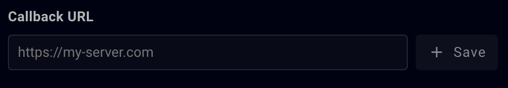

# Samply_Slack_Hook
Forwards incoming webhook request from Samply to Slack incoming webhook app

## Dependencies
This project uses the following modules:

[@slack/webhook](https://www.npmjs.com/package/@slack/webhook)

[body-parser](https://www.npmjs.com/package/body-parser)

[dotenv](https://www.npmjs.com/package/dotenv)

[express](https://www.npmjs.com/package/express)

**Install dependencies:**

`$ npm install`

## Create a Slack App
[Create a slack app to enable incoming webhooks](https://api.slack.com/messaging/webhooks)

## .env File
The .env file is in .gitignore for the obvious reasons of keeping private configurations private.

**Create a .env file in the root of project**

`$ touch .env`

Add the following to .env, replacing *Your Slack App URL*:

`SLACK_URL="Your Slack App URL"`

## Local Testing
Expose your localhost to a public URL.  I like the following

[localtunnel](https://theboroer.github.io/localtunnel-www/) or [ngrok](https://ngrok.com/)

Start your application:

`$ node index.js`

Start localtunnel on the same port as defined in index.js, e.g.,:

`lt --port 3000`

Obtain the URL from the console and head over to Samply.  In the notifications tab, enable all notifications by selecting checkboxes under `Webhooks`.  Paste your public tunnel URL into the `Callback URL` field and press `Save`

Head over to one of your projects and create a comment or other action you have selected for Webhook notifications.

Check your configured Slack app channel for the incoming message.

## License
[MIT](https://www.mit.edu/~amini/LICENSE.md)

Dependencies for this code include express, @slack/webhook, body-parser: [MIT](https://www.mit.edu/~amini/LICENSE.md)

dotenv: [BSD-2-Clause](https://opensource.org/license/bsd-2-clause/)